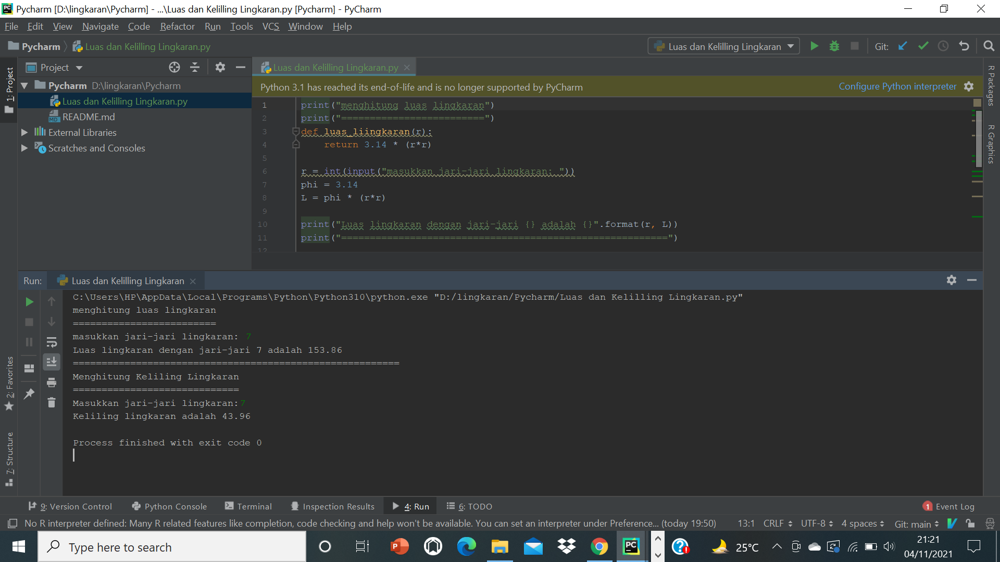
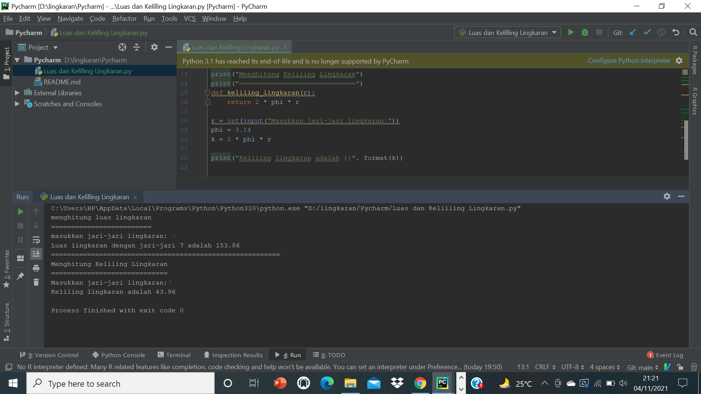
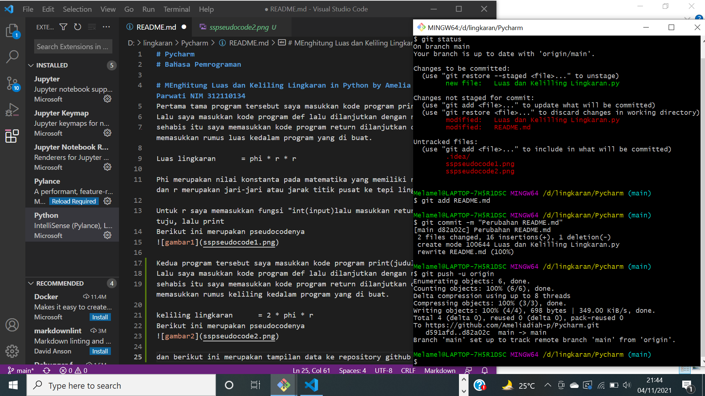

# Pycharm
# Bahasa Pemrograman

# MEnghitung Luas dan Keliling Lingkaran in Python by Amelia Diah Parwati NIM 312110134
Pertama tama program tersebut saya masukkan kode program print(judul)
Lalu saya masukkan kode program def lalu dilanjutkan dengan nama fungsi
sehabis itu saya memasukkan kode program return dilanjutkan dengan memasukkan rumus luas kedalam program yang di buat.

Luas lingkaran      = phi * r * r

Phi merupakan nilai konstanta pada matematika yang memiliki nilai 3.14 dan r merupakan jari-jari atau jarak titik pusat ke tepi lingkaran.

Untuk r saya memasukkan fungsi "int(input)lalu masukkan return yang di tuju, lalu print
Berikut ini merupakan pseudocodenya

Kedua program tersebut saya masukkan kode program print(judul)
Lalu saya masukkan kode program def lalu dilanjutkan dengan nama fungsi
sehabis itu saya memasukkan kode program return dilanjutkan dengan memasukkan rumus keliling kedalam program yang di buat.

keliling lingkaran      = 2 * phi * r 
Berikut ini merupakan pseudocodenya

dan berikut ini merupakan tampilan data ke repository github
